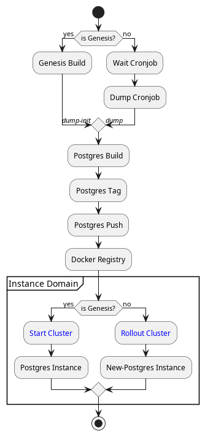
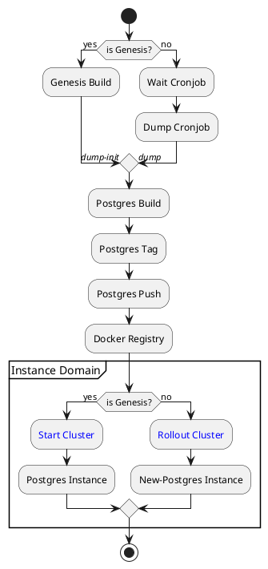

Cover the development of a test-space environment with DIA's platform. [Wiki](https://github.com/alexjorgef/diatestsuite/wiki) contain notes.

## Requirements

Minimum hardware recommended:

* 50 GB disk space available
* 8 GB memory available
* 4 CPU

The followding systems are covered:

* Architectures: x86_64
* Systems: Linux v6.3.9

Software dependencies needed:

* *bash*, *git*, *docker*, *docker-buildx*, *minikube*, *kubectl*, *jq*, *yq*

## Getting start

Run the script to manage the enviornment 🚀:

```sh
./env --help
```

## Diagrams

Structure:




