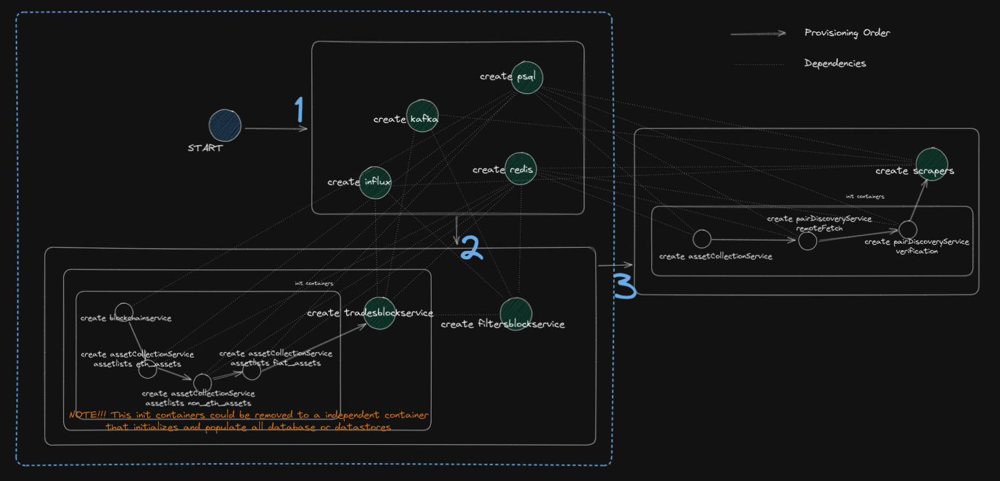

# DIA Development Toolkit

## Requirements

> Note: for supportted minikube's drivers check [this document](https://minikube.sigs.k8s.io/docs/drivers/)

* [minikube](https://minikube.sigs.k8s.io/docs/): minikube quickly sets up a local Kubernetes cluster
* [kubectl](https://kubernetes.io/docs/reference/kubectl/kubectl/): kubectl controls the Kubernetes cluster manager

Optional:

* [k9s](https://k9scli.io/): k9s is a terminal based UI to interact with your Kubernetes clusters

## Guides

### Getting Started

Initialize the cluster:

```shell
./deployments/init.sh
```

Start the cluster's containers:

```shell
./deployments/start.sh
```

You can stop the cluster's containers with:

```shell
./deployments/stop.sh
```

### Advanced

> Check Minikube [handbook](https://minikube.sigs.k8s.io/docs/handbook/)

Start Kubernetes Dashboard UI:

```shell
minikube dashboard --url=true --port=8083
```

Forward ports to your local machine:

```shell
kubectl port-forward diadata-clusterdev-db-postgres 5432:5432
kubectl port-forward diadata-clusterdev-db-redis 6379:6379
kubectl port-forward diadata-clusterdev-db-influx 8086:8086
kubectl port-forward diadata-clusterdev-http-restserver 8081:8081
```

## Endpoints

Kubernetes:

* Dashboard UI: http://localhost:8083/api/v1/namespaces/kubernetes-dashboard/services/http:kubernetes-dashboard:/proxy/

DIA Data:

* Rest Server: http://localhost:8081/

## Diagram



## Common Issues

### Add custom host to kubernetes

> ref: https://hjrocha.medium.com/add-a-custom-host-to-kubernetes-a06472cedccb

run `kubectl -n kube-system edit configmap/coredns` and edit forward and hosts fields:

```yaml
data: 
  Corefile: |
      .:53 {
          errors
          health
          ready
          kubernetes cluster.local in-addr.arpa ip6.arpa {
            pods insecure
            fallthrough in-addr.arpa ip6.arpa
          }
          prometheus :9153
          forward . 8.8.8.8 8.8.4.4
          cache 30
          loop
          reload
          loadbalance
          hosts custom.hosts mycustom.host {
            1.2.3.4 mycustom.host
            fallthrough
          }
       }
```

Now we just nee to reload the core-dns service by typing: `kubectl delete pod -n kube-system core-dns-#########`

### Fix minikube user permissions

> `❌  Exiting due to HOST_HOME_PERMISSION: unlinkat /home/USER/.minikube/ ...`

```shell
sudo chown -R $USER $HOME/.minikube; chmod -R u+wrx $HOME/.minikube
```